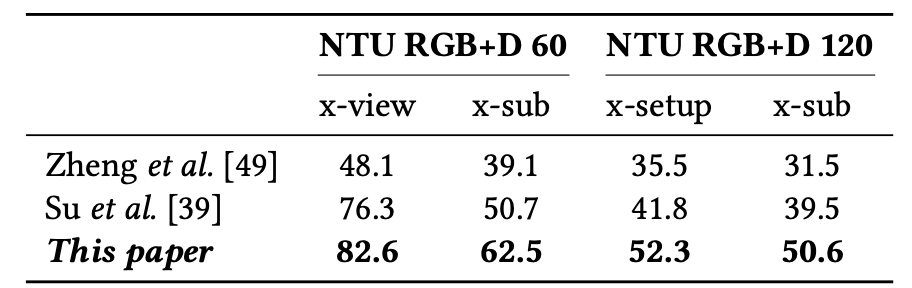
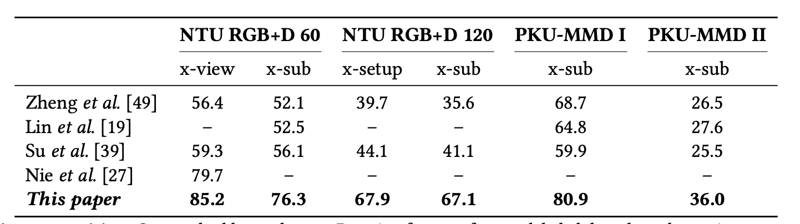

# Skeleton-Contrastive 3D Action Representation Learning


This repository contains the implementation of our ACM MultiMedia 2021 paper:

* inter-skeleton contrastive  pretraining
* 3D action recognition and retrieval downstream

### Link:

[[PDF]](https://fmthoker.github.io/publications/pdf/skeleton-contrast.pdf)
[[Arxiv]](https://arxiv.org/pdf/2108.03656.pdf)

### Requirements
```
 conda create -n  skeleton_contrast python=3.7 anaconda
 conda install pytorch==1.2.0 torchvision==0.4.0 -c pytorch
 pip install tensorboard

```

### Data prepreprocessing instructions
*  Download raw  [NTU-RGB+D 60 and 120](https://github.com/shahroudy/NTURGB-D)  and save to ./data folder

```
cd data_gen
python ntu_gendata.py
```

### Pretrain Instruction

* e.g Inter-skeleton contrast using seq-based and graph-based representation on cross-view NTU-60
```
CUDA_VISIBLE_DEVICES=0,1,2,3 python  main_moco_inter_skeleton.py \
  --lr 0.01 \
  --batch-size 64 \
  --mlp --moco-t 0.07   --moco-k 16384  --checkpoint-path ./checkpoints/ntu_60_cross_view/interskeleton_seq_based_graph_based  --schedule 351  --epochs 451  --pre-dataset ntu60 --skeleton-representation seq-based_and_graph-based --protocol cross_view
```
* check [script_pretrain.sh](https://github.com/fmthoker/skeleton-contrast/blob/main/script_pretrain.sh) for other pretraining configrations

### Downstream Instruction
 * 3D Action Classification (Linear evaluation )
 * e.g Train a linear classifier on seq-based query encoder features pretrained via inter-skeleton contrast
```
CUDA_VISIBLE_DEVICES=0,1,2,3 python action_classification.py \
  --lr 0.1 \
  --batch-size 64 \
 --pretrained  ./checkpoints/ntu_60_cross_view/interskeleton_seq_based_graph_based/checkpoint_0450.pth.tar \
  --finetune-dataset ntu60 --protocol cross_view --pretrain-skeleton-representation seq-based_and_graph-based  --finetune-skeleton-representation seq-based
```

 * 3D Action  Retrieval (KNN evaluation)
 * Use a Knn classifier on seq-based query encoder features  pretrained via inter-skeleton contrast
```
 CUDA_VISIBLE_DEVICES=0,1,2,3 python action_retrieval.py \
  --lr 0.1 \
  --batch-size 64 \
  --knn-neighbours 1 \
  --pretrained  ./checkpoints/ntu_60_cross_view/interskeleton_seq_based_graph_based/checkpoint_0450.pth.tar \
 --finetune-dataset ntu60 --protocol cross_view --pretrain-skeleton-representation seq-based_and_graph-based  --finetune-skeleton-representation seq-based
```
  * Check [script_action_classification.sh](https://github.com/fmthoker/skeleton-contrast/blob/main/script_action_classification.sh) and [script_action_retrieval.sh](https://github.com/fmthoker/skeleton-contrast/blob/main/script_action_retrieval.sh) for other downstream configrations

### Pretrained Models

* NTU 60 and 120 : [pretrained_models](https://drive.google.com/drive/folders/1xkqs4bSPRVFrHhHC_TLPCbn4N_NfbZG7?usp=sharing)

### Results
* 3D Action Classification Results


* 3D Action  Retrieval Results



